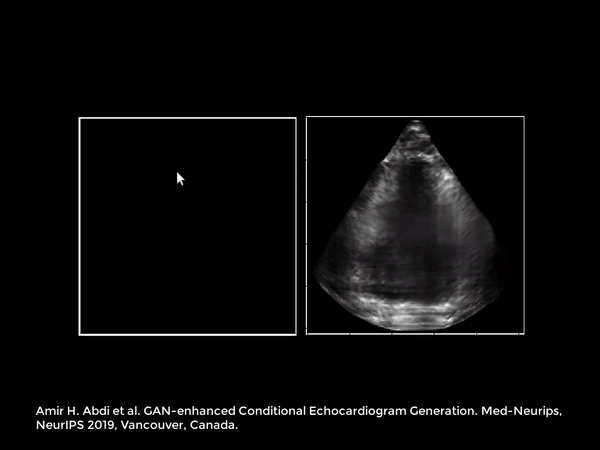

## GAN-enhanced Conditional Echocardiogram Generation   

This repository accompanies our manuscript in the 
Medical Imaging Meets NeurIPS workshop of 
the 33rd Conference on Neural Information Processing Systems (NeurIPS 2019), Vancouver, Canada. \
The draft of the manuscript is available here: [https://arxiv.org/abs/1911.02121](https://arxiv.org/abs/1911.02121). 

If you found this code useful in your research, please consider citing:

    @misc{abdi-echoGen,
    Author = {Amir H. Abdi and Teresa Tsang and Purang Abolmaesumi},
    Title = {GAN-enhanced Conditional Echocardiogram Generation},
    Year = {2019},
    Eprint = {arXiv:1911.02121},
    }

#### Requirements & 

- The implementation uses Keras with TensorFlow backend.
- scikit-image, SimpleITK, and matplotlib are used for data augmentation and 
visualization.
- Training is logged using the Weights & Biases tool ([wandb](www.wandb.com)).

Install the requirements by running

    pip3 install -r requirements.txt
    

Alternatively, make a  image
by running:

    docker build -t echo-generation .
A ready-to-use docker image is also available on [docker hub](https://cloud.docker.com/u/amirabdi/repository/docker/amirabdi/echo-generation).

#### Data

We use the publicly available dataset of [CAMUS](https://arxiv.org/pdf/1908.06948.pdf), 
which can be downloaded from [here](http://camus.creatis.insa-lyon.fr/challenge/#challenge/5ca20fcb2691fe0a9dac46c8).

    
#### Training

To train the model call `main.py` with a 
config file of your choosing. 
The 5 config files corresponding to the 5 experiments of the article are
available in the `configs/` directory, e.g.

     python3 src/main.py \
     --dataset_path=$DATASETS/CAMUS \
     --config=configs/ventricle.json
     
The environment variable `$DATASET` is assumed to be set to 
where the CAMUS dataset directory is stored. 

#### Sample Generated Echos

Check the complete video on [YouTube](http://www.youtube.com/watch?feature=player_embedded&v=9rfaL2uxkyc).

