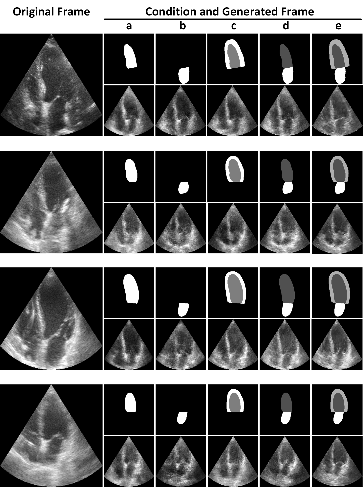

## GAN-enhanced Conditional Echocardiogram Generation   

This repository accompanies our submission to the 
SASHIMI workshop of 
the 22nd International Conference on Medical Image Computing and Computer Assisted Intervention (MICCAI 2019), 
which will be held from October 13th to 17th, 2019, in Shenzhen, China.

#### Training

This is a Python3 implementation. To train the models, first install the requirements by running

    pip3 install -r requirements.txt

Subsequently, to train the model call `main.py` with a 
config file of your choosing. 
The 5 config files corresponding to the 5 experiments of the article are
available in the `configs/` directory.   

     python3 src/main.py \
     --dataset_path=$DATASETS/CAMUS \
     --config=configs/ventricle.json
     
The environment variable `$DATASET` is assumed to be set to 
where the CAMUS dataset directory is stored. 

#### Sample Generated Echos

